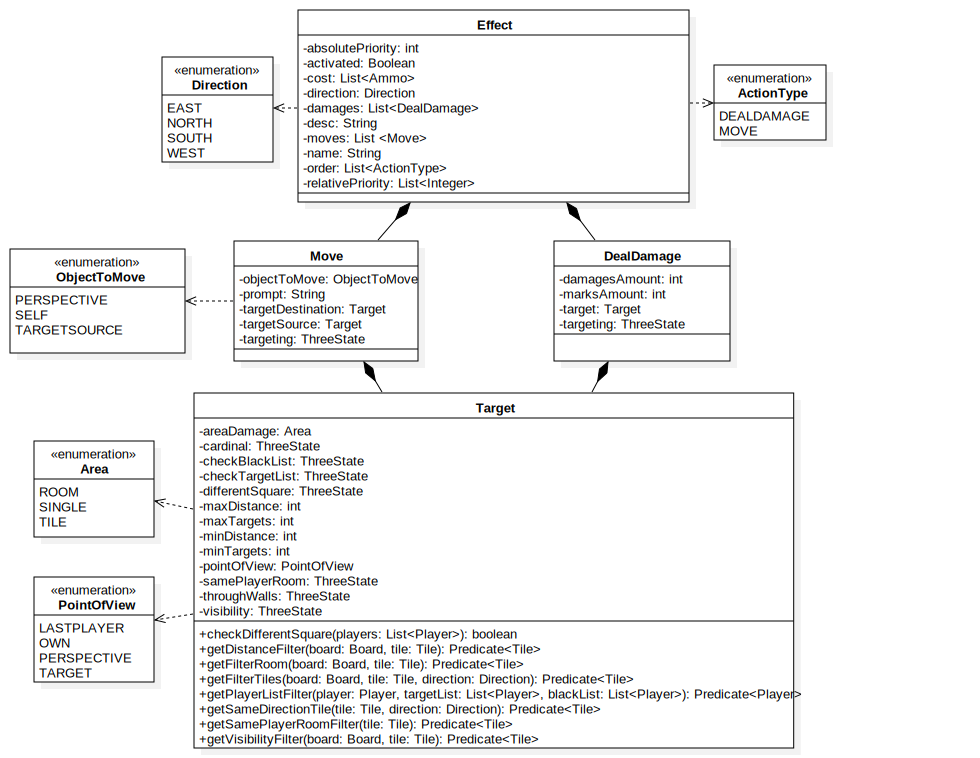
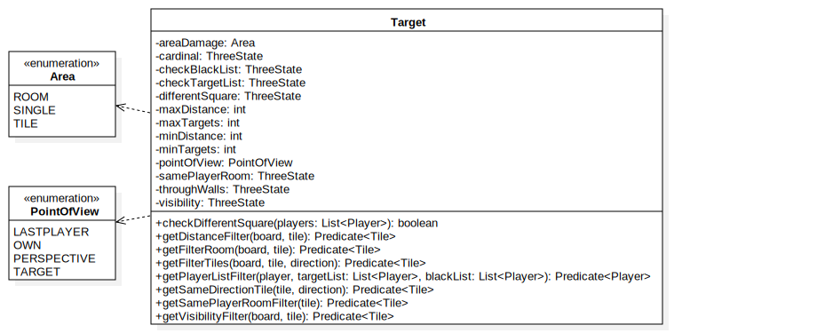
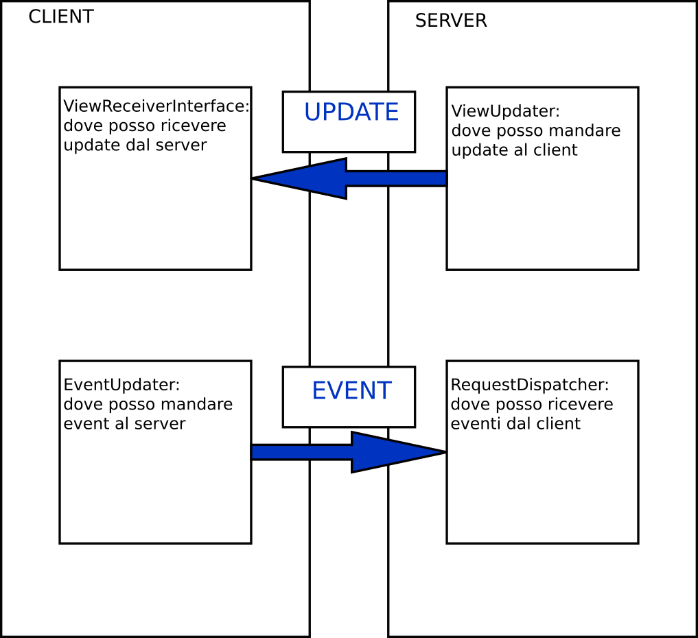
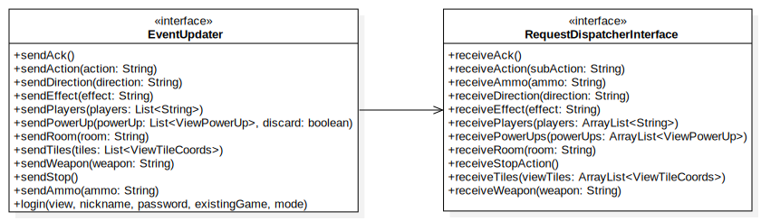
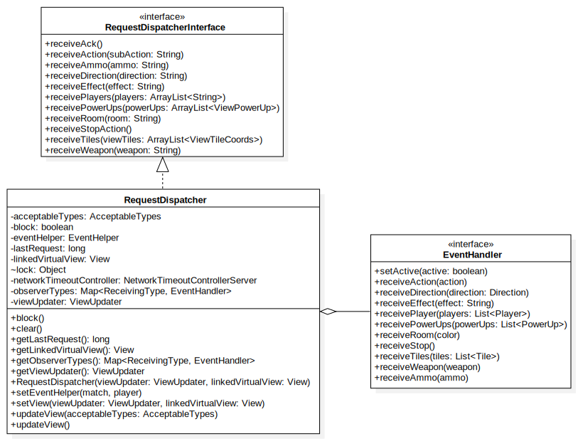
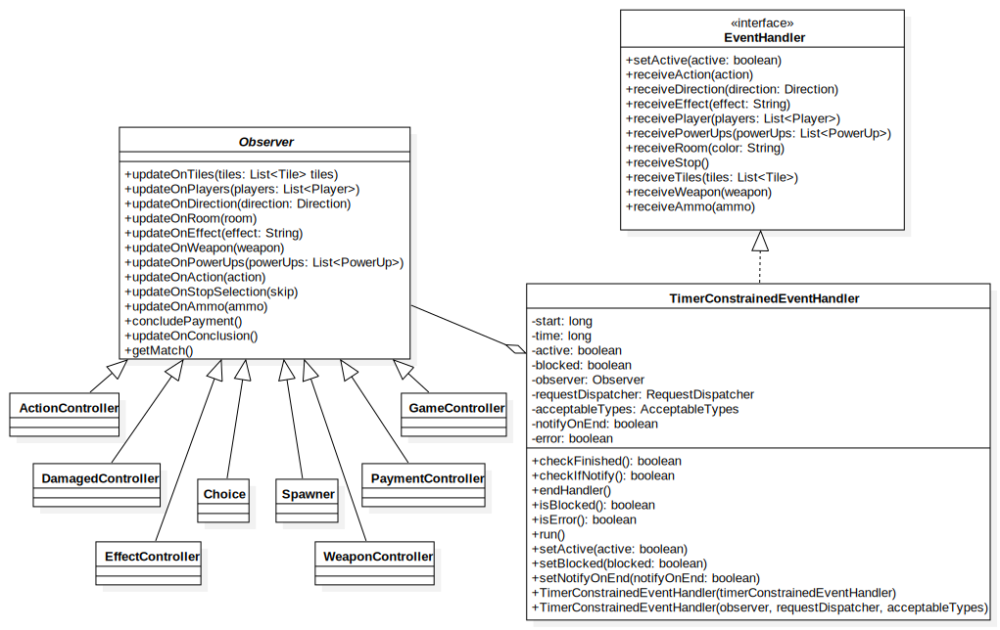

## Sistema delle armi
- Armi e powerup configurabili con un formato leggibile e compatto ad hoc
- Aggiunta di armi semplice

---

# {data-background-color="#fdf6e3" data-transition="zoom-out"}
Overview classi per gli effetti
{ max-height=600px }

---

# {data-background-color="#fdf6e3" data-transition="zoom-in"}
## Target
{ max-height=580px }

---

# Network
Il network è stato astratto tra socket ed RMI tramite l'utilizzo di 4 interfacce, che si occupano di mandare e ricevere messaggi fra network e client

---

# {data-background-color="#fdf6e3"}
{ height=630px }

---

# {data-background-color="#fdf6e3"}
## Client → Server
{ max-height=600px }

---

# {data-background-color="#fdf6e3"}
## Controller server
{ max-height=600px }

---

# {data-background-color="#fdf6e3"}
## EventHandler
{ max-height=600px }